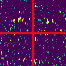
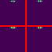
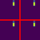
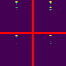
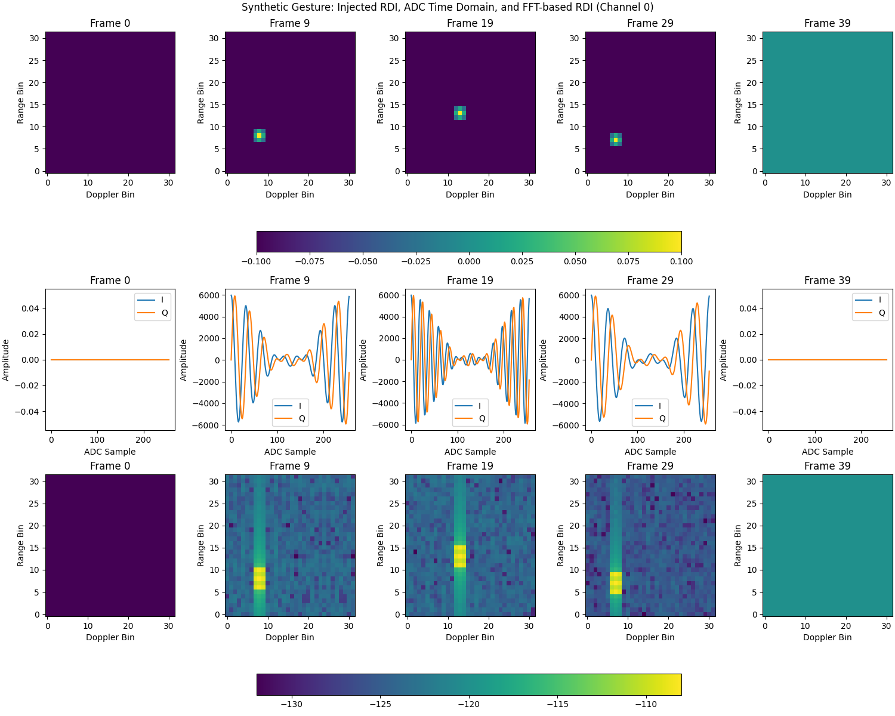

# Ti mmWave to Soli Pipeline

Python scripts for visualizing and processing raw IQ data from Texas Instruments mmWave radar (specifically IWR6843AOP with DCA1000), converting it to HDF5 Soli format, and running the gesture model.


## Overview

This tool processes raw ADC (Analog-to-Digital Converter) data captured by an IWR6843AOP mmWave sensor and a DCA1000 capture card. It parses a mmWaveStudio TXT configuration file to understand the radar's operational parameters, performs a series of signal processing steps, and outputs the processed data into an H5 file adhering to the HDF5 Soli format v1.0. Visualizations can be created for the generation, intermediate processing stages, and the final output. The `rdgifh5.py` script generates animated GIF images from H5 Soli files.

### Selected Visualizations

Example GIF views of 4 channel H5 files: (radar baseline, radar gesture, synthetic gesture, training data)






#### Synthetic Gesture Generation


The primary script, `mmwave_to_soli.py`, implements the conversion process. It includes features such as background subtraction using a rolling Gaussian model and Doppler-onset detection to generate Soli-compatible HDF5 files.

The signal processing pipeline in `mmwave_to_soli.py` consists of the following stages:
*   Range FFT (with Hann window)
    *   Optional: DC Removal (mean subtraction along chirp axis)
*   Doppler FFT
    *   Optional: Doppler Bandpass Filter (Butterworth band-pass)
*   Center Zero Doppler (FFT shift)
*   Magnitude Calculation and Log Scaling
    *   Optional: Range Gating (selects a range of interest)
    *   Optional: Range Axis Interpolation (upsamples range bins)
    *   Optional: Gaussian Smoothing
    *   Optional: Temporal Filter
    *   Optional: Iterative Background Subtraction
    *   Optional: Min-Max Truncation Percentiles
    *   Optional: CA-CFAR
    *   Optional: Suppress Zero Doppler Bins
    *   Optional: Doppler Onset Detection
    *   Optional: Temporal Trimming/Padding
*   Frame Reshaping for Output (each frame's Range-Doppler image is typically padded/cropped to 32x32 and then flattened for HDF5 storage)


## Requirements

- Windows 10 or 11
- Python 3.10
- A full list of required Python packages is available in the `requirements.txt` file.
- A GIF viewer for viewing HD5 frames, such as `bandisoft.com/honeyview`

## Installation

1. Clone this repository
2. Setup Python and packages:

### Conda Setup (Recommended)
For a more stable environment, it is recommended to use Conda, or at least some other env isolation.
```bash
conda create --name soli_env python=3.10
conda activate soli_env
```
### Install Requirements
```bash
pip install -r requirements.txt
```


## Workflows

This section outlines common ways to use the scripts in this project, from manual step-by-step processing to automated workflows.

### 1. Quick Test (Windows Batch Script)

A batch script `test_pipeline_integrity.bat` is provided for users to quickly test the basic data generation and conversion pipeline (`generate_test_data.py` followed by `mmwave_to_soli.py`). It also saves Range-Doppler plots at the different stages.

```bash
test_pipeline_integrity.bat
```
-  All intermediate visualizations are saved to the `screenshots` folder.
-  All the dumps used for validation are saved to the `dumps` folder.

The following steps are performed:

1. **Checks for Python and Required Packages:**
   Ensures Python 3.10 and the required packages are installed.

2. **Cleans Up Old Frame Dumps**
   Deletes any previous frame dump files from the `dumps` directory.

3. **Generates Synthetic Test Data**
   Runs `generate_test_data.py` to create a synthetic binary data file (`test_data.bin`) using `example_config.txt`.

4. **Converts Test Data to Soli Format**
   Runs `mmwave_to_soli.py` to convert the generated binary data into a Soli-compatible HDF5 file (`test_gesture.h5`).

5. **Verifies ADC Export/Import Alignment**
   Runs `verify_export.py` to check that the exported and imported ADC frames are aligned.

6. **Verifies HDF5 Output**
   Runs `verify_hdf5.py` to ensure the generated HDF5 file conforms to the Soli format.

7. **Verifies RDI Dumps**
   Runs `verify_RDI.py` to check the Range-Doppler Image (RDI) dumps.

8. **Generates RDI GIF Animation**
   Runs `rdgifh5.py` to create an animated GIF from the HDF5 file for visualization.

If any step fails, the script stops and displays an error message. On success, it reports completion and the location of the output file.

### 2. Provided Automated Workflow in `soli_commands.txt`

Assumed File Locations:
 - Soli keras model is here: `<USER HOME DIR>\Downloads\MODELS\soli_model.keras`
 - The run will be saved in: `<USER HOME DIR>\DATA\Save`
 - If the run exists, it will first be renamed to `<USER HOME DIR>\DATA\Save.<TIMESTAMP>`

Note: The default GIF application is launched.  The best free GIF viewer I found for this workflow to be `bandisoft.com/honeyview`

To monitor the mmWaveStudio postprocessed output `adc_data.bin` and run when it changes:
```
python watch_and_run.py "C:\ti\mmwave_studio_02_01_01_00\mmWaveStudio\PostProc\adc_data.bin" --cmds soli_commands.txt
```

To immediately `run` the pipeline `1` time and exit:
```
python watch_and_run.py "C:\path\to\adc_data.bin" --cmds soli_commands.txt -r -1
```

### 3. Manual Step-by-Step Processing

Each step is outlined here for understanding a typical workflow.

**a. Data Generation (Optional):**
If you don't have real sensor data, generate test data. This will create a `test_data.bin` file based on `example_config.txt`.

```bash
python generate_test_data.py --cfg example_config.txt --out test_data.bin --frames 100 --gesture
```

**b. Data Conversion:**
Convert the raw data (either generated, like `test_data.bin`, or from your sensor, e.g., `your_data.bin`) to Soli HDF5 format using `mmwave_to_soli.py`:

```bash
python mmwave_to_soli.py --cfg your_config.txt --bin your_data.bin --out your_output.h5 --label <gesture_label>
```
(Replace `<gesture_label>` with the appropriate numeric label for your data).

**c. Verification (Optional):**
Check if the generated HDF5 file conforms to the Soli format.

```bash
python verify_hdf5.py --file your_output.h5
```

**d. GIF Generation (Optional):**
Create an animated GIF from the HDF5 file for quick visualization.

```bash
python rdgifh5.py your_output.h5
```

**e. Prediction (Optional):**
Perform gesture prediction using a trained model.

```bash
python soli_predict.py --model_path <path_to_model.keras> --h5_file your_output.h5
```

### 4. Example Automated Workflow using `watch_and_run.py`

For continuous processing, especially with live data capture (e.g., from DCA1000), `watch_and_run.py` can automate the conversion, GIF generation, and prediction steps.

First, configure a command file (e.g., `soli_commands.txt`) with the desired sequence of operations. Use placeholders like `%s` for the input file that `watch_and_run.py` monitors, `%b` for its basename, etc.
For more detailed information, see the "Usage" section.

**Example `soli_commands.txt` content:**
(Refer to the actual `soli_commands.txt` in the repository for a complete example, as the content below is illustrative.)
```
# Example line for mmwave_to_soli.py pipeline:
python mmwave_to_soli.py --cfg config.txt --bin %s --out %d/%b.h5 --label 0 --frames 40
python rdgifh5.py %d/%b.h5
python soli_predict.py --model_path model.keras --h5_file %d/%b.h5 --log predictions.log
```

Then, run `watch_and_run.py`, pointing it to the raw data file you expect to be updated (e.g., `DCA1000_ADC_Data/adc_data.bin`) and your command file:

```bash
python watch_and_run.py DCA1000_ADC_Data/adc_data.bin --cmds soli_commands.txt
```

This will trigger the commands in `soli_commands.txt` whenever `DCA1000_ADC_Data/adc_data.bin` is updated or created. The placeholders in `soli_commands.txt` will be replaced with the details of the watched file.


## mmWave Sensor Configurations

The `mmWaveConfig` directory contains example XML files representing chirp configurations for the mmWave sensor, used with Texas Instruments' mmWaveStudio. These files define the low-level parameters for the radar sensor's operation. Examples include:

*   `SoliData.xml`: A potential baseline chirp configuration.
*   `SoliData_InterchirpPwr.xml`: An alternative configuration, to evaluate noise without dynamic inter-chirp power saving.
*   `SoliData.xmldiff`: An xmldiff between `SoliData.xml` and `SoliData_InterchirpPwr.xml`

The processing script in this repository, `mmwave_to_soli.py`, consumes a `.txt` configuration file that is typically extracted from mmWaveStudio logs. This `.txt` file (specified via the `--cfg` argument in the script) is a direct representation of the parameters set up in mmWaveStudio, which are often loaded from these XML configuration files. While the Python script parses the `.txt` format, the XML files in `mmWaveConfig` provide the source or reference for these settings.


## Usage

This section details the primary scripts used for data conversion and processing.

### Core Processing Script

#### Main Converter: `mmwave_to_soli.py`

This is the primary script for converting raw mmWave sensor data (IWR6843AOP + DCA1000) into the HDF5-based Soli format. As noted in the Overview, its key signal processing features include background subtraction using a rolling Gaussian model and Doppler-onset detection.

**Command-Line Arguments:**

```bash
python mmwave_to_soli.py --cfg <config_file> --bin <binary_file> --out <output_file> --label <label> [--frames <num_frames>] [--show]
```

-   `--cfg <file>`: Path to the mmWaveStudio TXT configuration file to be parsed
-   `--bin <file>`: Path to the raw `adc_data.bin` file
-   `--out <file>`: Path for the destination HDF5 file in Soli format
-   `--label <int>`: Numeric gesture label for the Soli dataset class index
-   `--frames <int>`: Optional: Fixed number of frames for the output sequence (default: 57)
-   `--show`: Optional: If present, display intermediate Range-Doppler images

### Example for `mmwave_to_soli.py`

```bash
python mmwave_to_soli.py --cfg profile.txt --bin adc_data.bin --out gesture_01.h5 --label 8 --frames 40 --show
```


## Utility and Helper Scripts

This section covers various utility scripts for data generation, verification, visualization, and automated workflows.

### Test Data Generation: `generate_test_data.py`
This script (`generate_test_data.py`) creates a binary file that mimics the output of the DCA1000 capture card. It's useful for testing the conversion pipelines without actual hardware. Its usage is detailed in the "Example Workflows" section.

### HDF5 Verification: `verify_hdf5.py`

This script validates if an HDF5 file conforms to the Soli format v1.0 specifications. It checks for the presence and basic structure of required datasets (`ch0`, `ch1`, `ch2`, `ch3`, `label`) and attributes (`fps`, `range_bins`, `doppler_bins`).

**Command-Line Arguments:**

```bash
python verify_hdf5.py --file <path_to_hdf5_file>
```
-   `--file <path_to_hdf5_file>`: Path to the HDF5 file to be verified

### GIF Generation: `rdgifh5.py`

This utility creates animated GIFs from Soli HDF5 files. It generates a 2x2 mosaic displaying the Range-Doppler data from the four channels (each reshaped to 32x32 pixels for visualization). The generated GIFs are saved to `./screenshots/<basename_of_h5_file>.gif`.

**Command-Line Arguments:**

```bash
python rdgifh5.py <input_h5_file> [--delete | --cleanup]
```
-   `<input_h5_file>`: Path to the input Soli HDF5 file
-   `--delete`: If specified, the script will delete the temporary frames directory (e.g., `./screenshots/<basename_of_h5_file>_frames/`) and exit. This is useful for cleaning up if GIF generation was interrupted or is not needed
-   `--cleanup`: If specified, the script will delete the temporary frames directory after the GIF has been successfully created

### Automated Workflow: `watch_and_run.py`

This script monitors a specified input file (e.g., raw ADC data from the DCA1000) for updates. When the file is modified (or created, if it didn't exist), `watch_and_run.py` executes a series of commands defined in a separate text file. This is useful for automating a processing pipeline, such as converting newly captured radar data, running predictions, and generating visualizations.

**Command-Line Arguments:**

``` usage:
watch_and_run.py [-h] -c CMDS [-d DIR] [-o] [-i INTERVAL] [-r] [-1] file_to_watch
```
-   `file_to_watch`: The file to monitor for changes (e.g., `adc_data.bin`)
-   `-c` | `--cmds <command_file>`: Required. Text file containing the shell commands to execute, one per line
-   `-d` | `--dir <run_directory>`: Optional. Directory where the commands should be executed (defaults to the current working directory)
-   `-o` | `--override`: Optional. If present, continue running subsequent commands in the command file even if a previous command fails
-   `-i` | `--interval <seconds>`: Optional. Polling interval in seconds to check for file changes (default: 5.0)
-   `-r` | `--run`: Optional. If present, run commands immediately at startup if the `file_to_watch` already exists
-   `-1` | `--once`: Optional. If present, exit after the commands have been run once due to a detected change
-   `-h` | `--help`: Prints this help message and exits


**Command File Placeholders:**

The commands within the `<command_file>` can use the following placeholders, which will be substituted by `watch_and_run.py` at runtime:
-   `%s`: Full path to the `file_to_watch`
-   `%b`: Basename of `file_to_watch` (filename without extension)
-   `%e`: Extension of `file_to_watch` (e.g., `.bin`)
-   `%d`: Directory containing `file_to_watch`
-   `%h`: User's home directory
-   `%S`: Full path to `file_to_watch`, with forward slashes (useful for cross-platform compatibility in commands)
-   `%D`: Directory of `file_to_watch`, with forward slashes
-   `%H`: User's home directory, with forward slashes
-   `%t`: Timestamp in `YYYY_MM_DD-HH-MM-SS` format

A command file, `soli_commands.txt`, is provided, for an automated workflow that performs data management, processing and conversion, gesture prediction, and GIF generation.

### Gesture Prediction: `soli_predict.py`

This script uses a trained Keras model to make gesture predictions on new Soli HDF5 files. It loads the specified model and outputs the predicted gesture class. The script uses a predefined list of `CLASS_NAMES` (e.g., "Grab", "Pinch", "Swipe") for human-readable output of the prediction.

**Command-Line Arguments:**

```bash
python soli_predict.py --model_path <path_to_keras_model> --h5_file <path_to_input_h5_file> [--visualize] [--channel <0-3>] [--frames <number>] [--log <path_to_log_file>]
```

-   `--model_path <path_to_keras_model>`: Required. Path to the trained Keras model file (`.h5` or `.keras` format).
-   `--h5_file <path_to_input_h5_file>`: Required. Path to the Soli HDF5 file on which to perform prediction.
-   `--visualize`: Optional. If present, visualizes a specified number of frames from the input HDF5 data using `matplotlib`.
-   `--channel <0-3>`: Optional. The channel index (0, 1, 2, or 3) to visualize if `--visualize` is used (default: 0).
-   `--frames <number>`: Optional. The number of frames to visualize from the beginning of the sequence if `--visualize` is used (default: 5).
-   `--log <path_to_log_file>`: Optional. Path to a log file. If provided, the prediction result (timestamp, HDF5 filename, predicted class, confidence) will be appended to this file.


## Output Format

The output HDF5 file follows the Soli format v1.0 specifications. The `mmwave_to_soli.py` script aims to produce files compliant with this format.

- **Datasets**:
  - `ch0`, `ch1`, `ch2`, `ch3`: Four separate datasets, one for each of the RX antennas processed (typically 4). Each dataset has the shape `(N, 1024)` and `float32` type. `N` is the number of frames in the sequence (e.g., default 57 for `mmwave_to_soli.py` which can be overridden by the `--frames` argument). The second dimension (1024) represents the flattened Range-Doppler data for that channel, typically corresponding to `range_bins * doppler_bins` (e.g., 32 range bins * 32 Doppler bins = 1024).
  - `label`: Dataset with shape `(N, 1)` and `int32` type. Every frame in the sequence receives the same integer label, usually provided by a command-line argument (e.g., `--label` for `mmwave_to_soli.py`).

- **Attributes** (attached to the root of the HDF5 file):
  - `fps` (float): The derived or configured frame rate of the radar data.
  - `range_bins` (int): The number of range bins in the processed data (e.g., 32).
  - `doppler_bins` (int): The number of Doppler bins in the processed data (e.g., 32).
  - `comment` (str): A string containing an ISO 8601 timestamp of when the file was generated and the exact command-line string used to invoke the script.

The `verify_hdf5.py` script can be used to check if a given HDF5 file conforms to these structural expectations.


## License

This project is licensed under the MIT License - see the LICENSE file for details.
